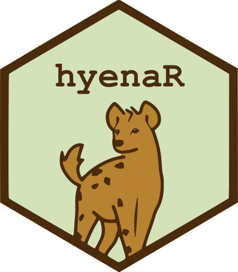

# Hexstickers for the Hyena Project

Welcome to the repository storing the hexagon images aimed at becoming hexstickers for the Hyena Project (Ngorongoro Crater)

<p align="center">
  
</p>


## How to get a hexsticker?

For the time being, you can download them from the respective folders show above.

In the near future we are planning to get some proper stickers (and magnets?) printed, which we will be able to send by post.


## How to add a new hexagon image?

Here are the guidelines adapted from https://github.com/maxogden/hexbin:

- make sure you're the owner of the hexagon you are submitting
- mind that the hexagon image need to fulfil the following requirements:

<p align="center">
  
</p>

- provide both a svg version (not too heavy) and a png (ideally of dimensions 181x209)
- write a `.json` file with the metadata for your hexagon image using his template:
```json
{
  "name": "Name_for_the_hexsticker",
  "author": "Jane Doe",
  "license": "CC0",
  "raster": "we will fill this for you",
  "vector": "we will fill this for you",
  "description": "tell us about what is the hexagon for",
  "order_online_url": "we will fill this for you"
}
```
- save this `.json` file with the same name as your image, but file extension `.json`
- send us the image and the `.json` file by email or submit a pull request


## Our official hexstickers

<p align="center">
  
</p>


## Our unofficial hexstickers

<p align="center">
  
  
</p>


